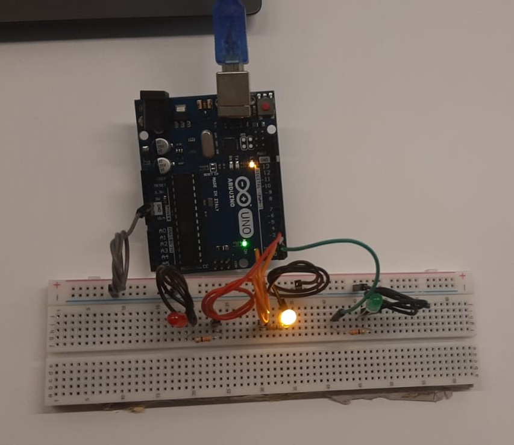
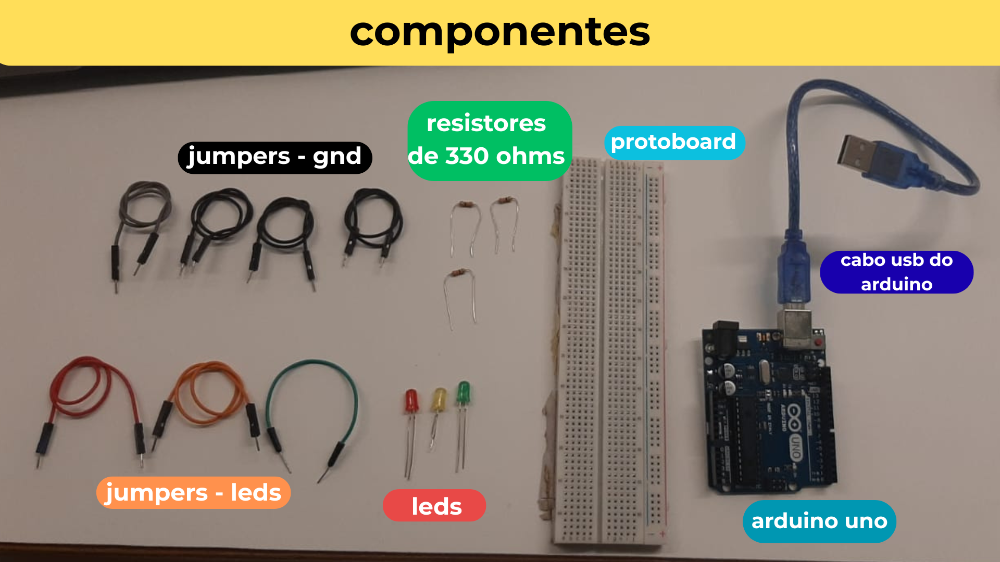

# Terceira ponderada - Semáforo com leds

## 1. Funcionamento do semáforo

Para realizar o semáforo, fiz um código simples que ajuda a piscar diferentes leds (vermelho, amarelo e verde), em loop, durante tempos diferentes. O led vermelho fica aceso por 6 segundos, depois se apaga e o amarelo acende. O amarelo fica aceso por 2 segundos, depois se apaga e o verde acende. O verde fica aceso por 4 segundos, depois se apaga e o vermelho acende. Isso ocorre em loop. Abaixo, segue uma foto do circuito montado.

<div align="center">
<sub>Figura 01: Imagem do circuito.</sub>
</div>
<div align="center">

</div>

<div align="center">
<sub>Fonte: a autora.</sub>
</div>

Para isso funcionar, após conectar o circuito no computador, abri o Arduino IDE e, depois de garantir que o Arduino Uno estava selecionado e a porta correta do computador estava conectada, pude rodar o código contido em `semaforo.ino`, presente após a imagem.

<div align="center">
<sub>Figura 02: Print do Arduino IDE.</sub>
</div>
<div align="center">

</div>

<div align="center">
<sub>Fonte: Arduino IDE.</sub>
</div>

```c++
void setup() {

  // conectei o led vermelho à porta 4, o led amarelo à porta 3 e o led verde à porta 2.
  #define LED_VERMELHO 4
  #define LED_AMARELO 3 
  #define LED_VERDE 2

  // definindo os leds como outputs
  pinMode(LED_VERMELHO, OUTPUT);
  pinMode(LED_AMARELO, OUTPUT);
  pinMode(LED_VERDE, OUTPUT);

}

void loop() {

  // é aqui que a lógica do semáforo ocorre.
  // o led vermelho começa o loop aceso
  digitalWrite(LED_VERMELHO, HIGH);
  // fica aceso por 6 segundos
  delay(6000);
  // depois desse tempo, o led vermelho se apaga e o led amarelo acende.
  digitalWrite(LED_VERMELHO, LOW); 
  digitalWrite(LED_AMARELO, HIGH);
  // fica aceso por 2 segundos
  delay(2000);
  // depois desse tempo, o led amarelo se apaga e o led verde se acende.
  digitalWrite(LED_AMARELO, LOW);
  digitalWrite(LED_VERDE, HIGH);
  // fica aceso por 4 segundos, e depois o loop recomeça.
  delay(4000);
  digitalWrite(LED_VERDE, LOW);

}
```

O código acima faz o semáforo funcionar.

## 2. Passo a passo das conexões

Aqui, detalho como eu realizei as conexões e o passo a passo da montagem do semáforo.

<div align="center">
<sub>Figura 03: Foto original dos componentes.</sub>
</div>
<div align="center">

</div>

<div align="center">
<sub>Fonte: a autora.</sub>
</div>

Coloquei, no semáforo, os seguintes componentes:

1. Protoboard - placa de prototipação de circuito.
2. Arduino Uno 
3. Jumpers preto, cinza, vermelho, verde e laranja
4. Led vermelho
5. Led amarelo
6. Led verde
7. 3 resistores de 330 ohms.
  
<div align="center">
<sub>Figura 04: Descrição dos componentes do semáforo.</sub>
</div>
<div align="center">

</div>

<div align="center">
<sub>Fonte: a autora.</sub>
</div>

As ligações realizadas foram as seguintes: 

- Com o primeiro fio preto, conectei o GND do arduíno à coluna negativa (-) da protoboard.

<div align="center">
<sub>Figura 05: Ligação entre o arduino (gnd) e a protoboard.</sub>
</div>
<div align="center">

</div>

<div align="center">
<sub>Fonte: a autora.</sub>
</div>

- Com os demais fios pretos, conectei o catodo de cada led à coluna negativa da protoboard.

- O anodo do led vermelho foi conectado a uma das pernas do resistor de 330 ohms.

- O anodo do led verde foi conectado a uma das pernas do resistor de 330 ohms.

- O anodo do led amarelo foi conectado a uma das pernas do resistor de 330 ohms.

<div align="center">
<sub>Figura 06: Ligação dos leds (exemplo: led verde).</sub>
</div>
<div align="center">

</div>

<div align="center">
<sub>Fonte: a autora.</sub>
</div>

- A outra perna do resistor do led vermelho foi conectado à porta 4 do Arduino.

- A outra perna do resistor do led amarelo foi conectado à porta 3 do Arduino.

- A outra perna do resistor do led verde foi conectado à porta 2 do Arduino.

<div align="center">
<sub>Figura 07: Circuito em funcionamento.</sub>
</div>
<div align="center">

</div>

<div align="center">
<sub>Fonte: a autora.</sub>
</div>

<div align="center">
<sub>Figura 08: Circuito explicado.</sub>
</div>
<div align="center">

</div>

<div align="center">
<sub>Fonte: a autora.</sub>
</div>

Abaixo, segue a representação esquemática do circuito descrito acima.

<div align="center">
<sub>Figura 09: Esquemático de circuito do TinkerCad.</sub>
</div>
<div align="center">

</div>

<div align="center">
<sub>Fonte: TinkerCad.</sub>
</div>

Com isso, o simulador roda mostrando o semáforo funcionando. A simulação completa pode ser observada em `semaforo.brd`.

Em `assets`, pode-se observar um vídeo do semáforo funcionando (`semaforo.mp4`), também presente [nesse link](https://drive.google.com/drive/folders/1DkYw8YLHpxLM2EqymPbq5dR6SqDOc484?usp=drive_link) do google drive.

## 1. Em sala - melhoria do semáforo

### Suporte ao semáforo

Em sala, usando o suporte de mdf dado pelo professor, coloquei o meu semáforo "em pé" para se assemelhar mais a um semáforo real, como nas fotos a seguir:

<div align="center">
<sub>Figura 10: Semáforo atualizado.</sub>
</div>
<div align="center">

</div>

<div align="center">
<sub>Fonte: TinkerCad.</sub>
</div>

<div align="center">
<sub>Figura 11: Semáforo atualizado.</sub>
</div>
<div align="center">

</div>

<div align="center">
<sub>Fonte: a autora.</sub>
</div>

<div align="center">
<sub>Figura 12: Semáforo atualizado.</sub>
</div>
<div align="center">

</div>

<div align="center">
<sub>Fonte: a autora.</sub>
</div>

Além disso, atualizei o código para adicionar o uso de Classes e objetos (programação orientada a objetos) e o uso de ponteiros. As vantagens de se atualizar o código estão comentadas abaixo dele:

```c++
// cria a classe LED
class LED
{
private:
    int pin;     // armazena o número do pino conectado ao LED
    bool state;  // guarda o estado atual do LED (true = ligado, false = desligado)

public:
    // constructor: recebe o pino e define o LED inicialmente para ele ficar desligado
    LED(int p) : pin(p), state(false) {}

    // configura o pino como saída e garante que o LED comece apagado
    void begin()
    {
        pinMode(pin, OUTPUT);
        digitalWrite(pin, LOW);
    }

    // Liga o LED (HIGH) e atualiza o estado interno
    void on()
    {
        state = true;
        digitalWrite(pin, HIGH);
    }

    // Desliga o LED (LOW) e atualiza o estado interno
    void off()
    {
        state = false;
        digitalWrite(pin, LOW);
    }

    // Inverte o estado atual (se estiver ligado, apaga; se estiver apagado, liga)
    void toggle()
    {
        state = !state;
        digitalWrite(pin, state ? HIGH : LOW);
    }

    // retorna o estado atual do LED (true = ligado, false = desligado)
    bool isOn() const { return state; }
};

// criação dos objetos LED (cada um ligado a um pino diferente do Arduino, no caso 2, 3 e 4)
LED led_vermelho(4);  // LED vermelho no pino 4
LED led_amarelo(3);   // LED amarelo no pino 3
LED led_verde(2);     // LED verde no pino 2

// agora criamos ponteiros que apontam para os endereços de memória desses objetos já existentes
LED *pVermelho = &led_vermelho;
LED *pAmarelo  = &led_amarelo;
LED *pVerde    = &led_verde;

// função de configuração (executada apenas uma vez ao iniciar o programa)
void setup()
{
    // inicializa cada LED chamando o método begin() através dos ponteiros
    pVermelho->begin();
    pAmarelo->begin();
    pVerde->begin();
}

// loop principal (repete pra sempre)
void loop()
{
    // liga o LED vermelho por 6 segundos e depois desliga
    pVermelho->on();
    delay(6000);
    pVermelho->off();

    // liga o LED amarelo por 2 segundos e depois desliga
    pAmarelo->on();
    delay(2000);
    pAmarelo->off();

    // Liga o LED verde por 4 segundos e depois desliga
    pVerde->on();
    delay(4000);
    pVerde->off();
}

// eu também poderia utilizar a função toggle para desligar e ligar os leds!
// o uso de classes permite o encapsulamento, que protege os detalhes internos do funcionamento do LED e evita que outras
// partes do código precisem saber como ele é controlado, ou seja, caso seja necessário mudar a forma de ligar o LED,
// basta alterar dentro da classe, sem precisar mexer de novo no resto do programa.
// a vantagem de usar ponteiros é que facilita a passagem de objetos para funções, ou seja, em vez de duplicar o objeto,
// a função apenas recebe o endereço dele, o que torna o código mais eficiente e evita cópias desnecessárias.
```
